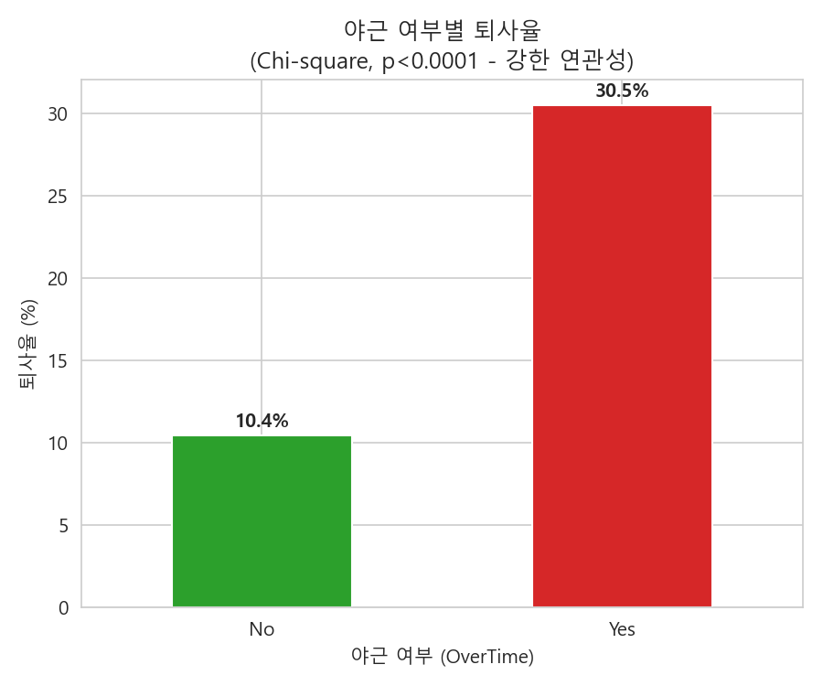
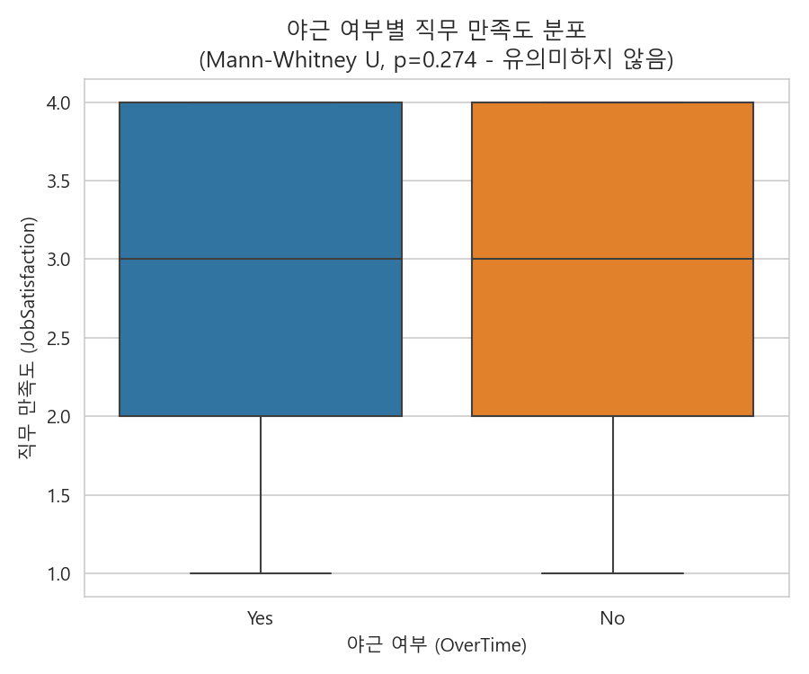
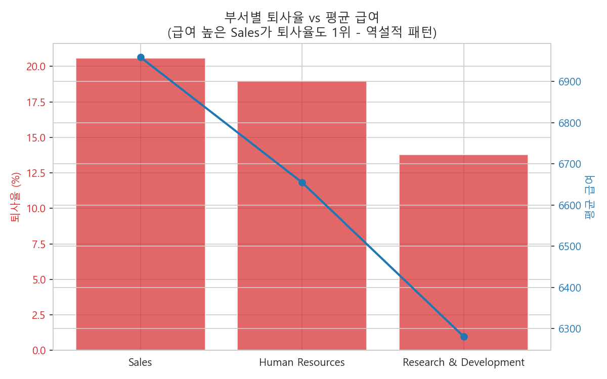
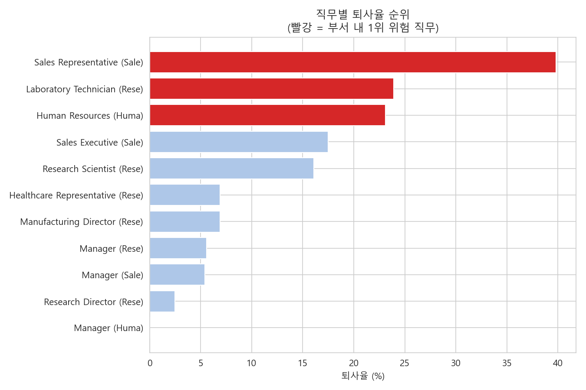

# HR 직원 퇴사 및 조직 관리 분석
# HR 직원 퇴사 리스크 분석 및 조직 관리 리포트

IBM HR Analytics 데이터를 활용해 조직 내 퇴사 리스크를 분석하고, 부서 및 직무 단위의 위험 요인을 도출하여 실무에서 활용 가능한 리스크 리포트를 구축한 End-to-End 데이터 분석 프로젝트입니다.

Python, SQL, Excel을 활용한 End-to-End 분석 파이프라인을 통해 데이터 정제, 통계 검정, 리스크 분석, 자동화 리포트 구축 과정을 구현했습니다.

---

## Highlights

| 항목 | 내용 |
|---|---|
| 데이터 | IBM HR Analytics (1,470행 × 35열) |
| 목표 | 부서·직무별 퇴사 리스크 분석 |
| 주요 기법 | EDA, Mann-Whitney U, Chi-square, SQL(Window Function), Excel Dashboard |
| 핵심 결과 | Sales·HR 위험 부서 식별, Sales Representative 퇴사율 39.8% |
| 산출물 | SQLite 분석 쿼리, Excel KPI Dashboard, 시각화 4종 |

---

## 프로젝트 배경

- 조직의 핵심 인재 이탈은 채용·교육 비용 증가와 직결되는 문제이지만, "왜" 퇴사하는지는 부서 단위 평균만으로는 파악하기 어렵습니다.
- 이 프로젝트는 두 가지 질문에서 출발했습니다.
  1. 야근 여부가 퇴사율과 통계적으로 유의한 관계가 있는가?
  2. 부서 평균 급여와 퇴사율은 어떤 관계를 가지며, 그 이면에 숨은 직무 단위 리스크는 무엇인가?

---

## 데이터셋

- **출처**: [IBM HR Analytics Employee Attrition & Performance](https://www.kaggle.com/datasets/pavansubhasht/ibm-hr-analytics-attrition-dataset) (Kaggle)
- **규모**: 1,470행 × 35컬럼 (정제 후 32컬럼)
- **주요 컬럼**: Age, Attrition, Department, JobRole, OverTime, MonthlyIncome, JobSatisfaction 등

---

## 분석 프로세스

### 1. Python — EDA 및 가설 검증

- 상수 컬럼(`EmployeeCount`, `Over18`, `StandardHours`) 제거 후 정제 데이터셋 구축
- **야근 여부 → 직무 만족도**: JobSatisfaction(1~4점)은 순서형 변수이므로 비모수 검정(Mann-Whitney U)을 적용 → p=0.274로 유의미한 차이 없음
- **야근 여부 → 실제 퇴사율**: 카이제곱 검정(χ²=87.56, p<0.0001) → 야근자 퇴사율 30.5% vs 비야근자 10.4%, 강한 연관성 확인
- → 만족도 설문에는 드러나지 않지만, 실제 퇴사 행동에는 야근이 뚜렷한 영향을 미친다는 대비를 확인

### 2. SQL (SQLite) — 부서별 퇴사율 집계 및 고위험 부서 식별

- `WHERE` → `GROUP BY` → `HAVING` → `CTE` → `Window Function` 순으로 기초부터 심화까지 단계적으로 쿼리 구성
- 부서별 퇴사율 집계 후 `HAVING`으로 전체 평균(16.1%) 초과 부서만 필터링 → Sales(20.6%), HR(19.0%) 위험군 도출
- `CTE + RANK() OVER (PARTITION BY Department ...)`로 부서 내 직무별 위험도 순위화 → Sales Representative(39.8%)가 전체 최고 위험 직무로 확인

### 3. Excel — KPI Summary Dashboard

- SQL에서 계산한 집계 로직을 Excel 수식(`COUNTIFS`/`AVERAGEIFS`/`SUMPRODUCT`)으로 재현하여 데이터 변경 시 자동으로 KPI가 갱신되도록 구성
- 퇴사율 컬럼에 조건부 서식(초록→노랑→빨강 색상 스케일)을 적용해 위험도를 시각적으로 표현
- 부서별/직무별 막대차트, KPI 카드형 대시보드 시트 포함

---

## Business Insights

1. **야근과 만족도는 무관하지만, 야근과 퇴사는 강하게 연관**됨 (χ²=87.56, p<0.0001) — 설문 기반 만족도만으로는 실제 퇴사 위험을 설명하기 어려움을 시사
2. **Sales 부서는 평균 급여가 가장 높은데도(6,959) 퇴사율도 1위(20.6%)**라는 역설적 패턴 발견
3. 직무 단위로 분해한 결과, 이 역설의 원인은 **Sales Representative**(급여 2,626 · 퇴사율 39.8%) 단일 직무였고, 같은 부서의 Sales Executive는 급여 6,924·퇴사율 17.5%로 안정적
4. R&D도 동일한 패턴: 부서 전체는 안정적(13.8%)이지만 Laboratory Technician만 떼어보면 23.9%로 부서 평균의 약 2배
5. **결론**: 부서 평균만으로는 퇴사 위험을 판단하기 어렵고, 직무 단위 분석이 반드시 병행되어야 한다는 점을 데이터로 확인함

---

## Dashboard

| Overtime | Satisfaction |
|---|---|
|  |  |

| Department | Job Role |
|---|---|
|  |  |

---

## 사용 기술

| 분야 | 기술 |
|---|---|
| Python | pandas, scipy (Mann-Whitney U, Chi-square), matplotlib, seaborn |
| SQL | SQLite, GROUP BY/HAVING, CTE, Window Function (RANK) |
| Excel | openpyxl, COUNTIFS/AVERAGEIFS/SUMPRODUCT, 조건부 서식, 네이티브 차트 |

---

## 폴더 구조

```
hr-attrition-analysis/
├── data/
│   ├── raw/                 
│   └── processed/            
├── notebooks/                
├── sql/
│   ├── hr_analysis.db
│   └── queries/               
├── excel/
│   └── HR_Risk_Report.xlsx
├── outputs/charts/          
└── README.md
```

---

## 실행 방법

### Python

1. `notebooks/01_eda_overtime_satisfaction.ipynb` 실행 → 통계 검정 결과 확인
2. `notebooks/02_clean_and_export.ipynb` 실행 → `data/processed/hr_cleaned.csv` 생성

### SQLite

1. `notebooks/03_load_to_sqlite.ipynb` 실행 → `sql/hr_analysis.db` 생성
2. `sql/queries/*.sql` 실행 → 부서별/직무별 리스크 통계 확인

### Visualization

1. `notebooks/04_visualize.ipynb` 실행 → `outputs/charts/` 에 시각화 저장

### Excel Dashboard

1. `excel/HR_Risk_Report.xlsx` 열어 대시보드 확인

---

## 개선 방향

1. Power BI/Tableau 기반 부서별 Drill-down 대시보드 구축
2. 다년도 데이터 확보 시 시계열 기반 리텐션 모니터링으로 확장
3. 급여 변화를 가정한 정책 효과 시뮬레이션(시나리오 분석) 추가
4. 로지스틱 회귀 등 예측 모델을 통한 개별 직원 단위 퇴사 확률 스코어링

---

## 프로젝트에서 얻은 점

- 비모수 검정과 카이제곱 검정을 활용해 가설을 검증하는 과정을 경험
- SQL Window Function을 이용해 부서별 직무 리스크를 계층적으로 분석
- Python → SQLite → Excel로 이어지는 분석 파이프라인을 구축
- Excel 수식을 활용한 자동화 KPI 리포트를 구현
